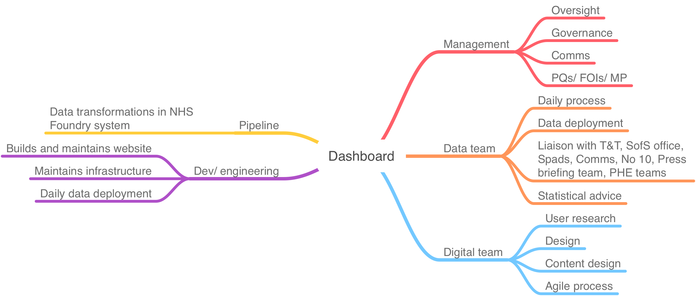

```{r setup, include=FALSE}
knitr::opts_chunk$set(echo = TRUE)
```

# Introduction

The coronavirus dashboard (<https://coronavirus.data.gov.uk>) is the public facing site for daily publication of official UK figures on the COVID pandemic. To deliver the dashboard we

-   process over 500m rows of data daily to generate 100m data points which populate the website front end with \> 200 metrics for 6791 MSOAs and 700 higher geography

-   publish data on tests, cases, deaths, healthcare metrics and vaccinations.

-   present information as a series of summaries, charts (epidemic curves) and tables

-   make small area data available via an interactive map which includes a slider to view trends over time.

-   update the R number and growth rate weekly.

-   provide localisation services via postcode searching, and map zooming.

-   provide easy read reports daily for every area for which we have data

-   provide extensive access to all the data via downloads, API calls

-   

It now serves in excess of 800,000 unique users a day, with a peak of 80,000 view a minute in the period. 5 Tb of data is downloaded daily. l

```{r, cache=TRUE}

library(higaR)
library(patchwork)
library(changepoint)
library(ggfortify)

stats <- read_rds("db_ga.rds")

# cp <- changepoint::cpt.mean(stats$users, method = "BinSeg", Q = 5) %>%
#   rownames(stats$date)
# 
# autoplot(cp)
# 
# stats[cp@cpts, ]

stats %>%
  arrange(desc(date)) %>%
  slice(-1) %>%
  ggplot(aes(date, users), colour = "red") +
  geom_line()  +
  geom_vline(xintercept = as.POSIXct("2020-10-13"), lty = "dotted") +
  geom_vline(xintercept = as.POSIXct("2020-08-04"), lty = "dotted") +
  #geom_line(aes(date, newUsers), colour = "blue" ) +
  #geom_line(aes(date, pageviews)) +
  scale_y_log10(labels = scales::comma) +
  labs(y = "Volume") 
 

```

### Users

95% of our users are members of the general public but the service is widely used in central government including PHE, T&T and JBC; local goverment; the NHS; national and local media; academics, and international reporting agencies.

We calculate

-   UK figures which are reported daily on mainstream media

-   Daily sitreps

-   MSOA data

-   5 metrics for tier decisions

-   Rates, rolling average, rolling sums for several metrics

It has evolved in 4 phases

## How it works

### Daily process - brief overview of timeline

```{r}

library(timevis)
library(lubridate)

timevis::timevis(
  data.frame(id = 1:10, 
             group = c(1, 1, 2, 1, 2, 3, 4, 5, 4, 4), 
             groups = data.frame(id = 1:5, content = c("Data creation", "Data processing", "Pipeline", "Data deployment", "QA")),
             content = c("Cases batch traced", "Cases sent to Foundry", "Case data processed", "Deaths data processed", "DA data added", "Pipeline runs", "Pre release", "Final QA" ,"Data release", "Website fully updated"),
             start = c("2021-01-28 22:00", "2021-01-29 08:30", "2021-01-29 08:30", "2021-01-29 09:30", "2021-01-29 14:00", "2021-01-29 14:00", "2021-01-29 15:30", "2021-01-29 15:50", "2021-01-29 16:00", "2021-01-29 16:20"),
             end =   c("2021-01-29 09:00",  NA, "2021-01-29 10:30", "2021-01-29 13:30", NA, "2021-01-29 15:45", NA,  NA, NA, NA),
             options = list(editable = TRUE))
) %>%
  setGroups(data.frame(id = 1:5, content = c("Group 1", "Group 2", "Group 3", "Group 4", "Group 5")))

```

-   Data is ingested from a wide range of data sources daily including PHE, NSHE, Test and Trace, Scottish, Welsh and Irish govt and public health agencies into the NHS Foundry System

-   Data is a mix of large record datasets, spreadsheets and API calls

-   Each data set undergoes a set of transformations (cleaning, aggregating) and calculations to extract the aggregate data from inputs or create metrics from the raw data. About x transformations are performed on the data

-   This generated a set of outputs which are then transferred to blob storage on the NHS England Azure tenant. From there the data are uploaded to the dashboard database and made available

-   Data is analysed to provide outputs for sitreps, EPicell, local authorities, DHSC and others.

-   Data is released at 4 pm daily in a single deployment.

-   Daily deaths (28 days)

    -   The SGSS team send case data to NHS Digital batch tracing service for over night processing - this adds the fact of death. Tracing is done in batches of 250k records

    -   The traced files are shared with Epicell first thing in the morning who then link additional data to generate a line list of deaths which is sent to the Foundry system - usually by 1pm

-   SGSS

    -   The dashboard takes several daily SGSS feeds for cases, positivity and tests during the course of the day.

    -   SGSS is updated by overnight feeds from labs

## Dashboard team

Insert organogram

#### Five teams



-   Dev team

    -   Front and back end development - API/ web pages/ databases

    -   Liaison with Microsoft team who manage Azure infrastructure

        -   Data stores

        -   Cache

        -   CDN

        -   APi Management services

        -   Resilience

        -   Scaling

-   Data team

    -   Daily process

    -   Daily deployment (G6s)

    -   Layouts

    -   Data design

    -   Negotiation on data additions

    -   Data for daily press conferences

    -   Pre-release data

    -   Ad hoc analysis

    -   

-   Pipeline team

    -   Data flows and data management

-   Digital team

    -   User interaction design

    -   Content design

    -   Agile management

    -   

-   Management team

## Governance

## Risks and resilience

:   

## 

## Recommendations
