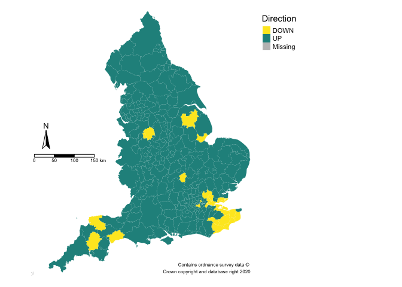
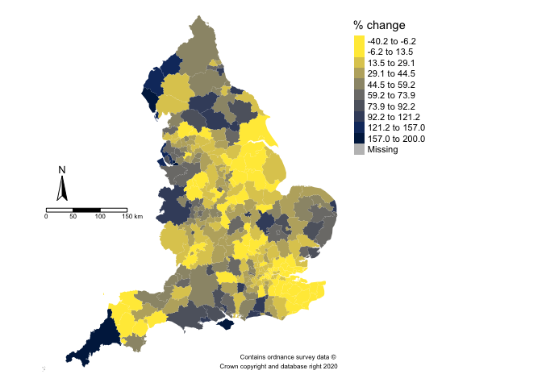
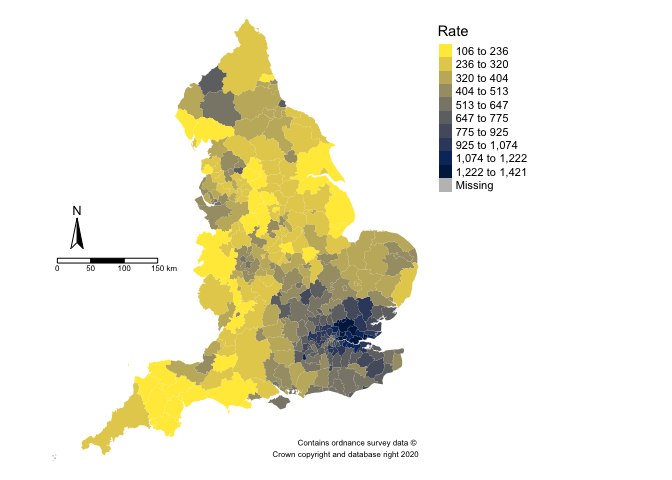

LA case maps
================
2021-01-04

## 

``` r
library(data.table)
library(tmap)
library(ggmap)
library(geojsonio)
library(tidyverse)
```

``` r
la <- fread("https://api.coronavirus.data.gov.uk/v2/data?areaType=ltla&metric=newCasesBySpecimenDateRollingRate&metric=newCasesBySpecimenDateChangePercentage&metric=newCasesBySpecimenDateDirection&format=csv")
la1 <- la[date == max(date), ]
```

``` r
skimr::skim(la1)
```

|                                                  |      |
|:-------------------------------------------------|:-----|
| Name                                             | la1  |
| Number of rows                                   | 380  |
| Number of columns                                | 7    |
| \_\_\_\_\_\_\_\_\_\_\_\_\_\_\_\_\_\_\_\_\_\_\_   |      |
| Column type frequency:                           |      |
| character                                        | 4    |
| Date                                             | 1    |
| numeric                                          | 2    |
| \_\_\_\_\_\_\_\_\_\_\_\_\_\_\_\_\_\_\_\_\_\_\_\_ |      |
| Group variables                                  | None |

Data summary

**Variable type: character**

| skim\_variable                  | n\_missing | complete\_rate | min | max | empty | n\_unique | whitespace |
|:--------------------------------|-----------:|---------------:|----:|----:|------:|----------:|-----------:|
| areaType                        |          0 |              1 |   4 |   4 |     0 |         1 |          0 |
| areaCode                        |          0 |              1 |   9 |   9 |     0 |       380 |          0 |
| areaName                        |          0 |              1 |   4 |  36 |     0 |       380 |          0 |
| newCasesBySpecimenDateDirection |          0 |              1 |   2 |   4 |     0 |         3 |          0 |

**Variable type: Date**

| skim\_variable | n\_missing | complete\_rate | min        | max        | median     | n\_unique |
|:---------------|-----------:|---------------:|:-----------|:-----------|:-----------|----------:|
| date           |          0 |              1 | 2020-12-30 | 2020-12-30 | 2020-12-30 |         1 |

**Variable type: numeric**

| skim\_variable                         | n\_missing | complete\_rate |   mean |     sd |    p0 |    p25 |   p50 |    p75 |   p100 | hist  |
|:---------------------------------------|-----------:|---------------:|-------:|-------:|------:|-------:|------:|-------:|-------:|:------|
| newCasesBySpecimenDateRollingRate      |          0 |              1 | 472.35 | 285.09 |   4.5 | 259.50 | 402.7 | 601.50 | 1420.8 | ▆▇▃▂▁ |
| newCasesBySpecimenDateChangePercentage |          0 |              1 |  38.84 |  52.33 | -40.2 |  12.07 |  29.1 |  55.52 |  666.7 | ▇▁▁▁▁ |

``` r
shp <- "https://opendata.arcgis.com/datasets/3a4fa2ce68f642e399b4de07643eeed3_0.geojson"  ## la shape file from Open Geography portal

palette <- rev(viridis::cividis(15))
palette1 <- viridis::viridis(3, direction = -1)
credits <- "Contains ordnance survey data © \nCrown copyright and database right 2020"


## Download the data and convert to spatial polygon data frame
geodata <- geojson_read(shp, what = "sp")

# glimpse(geodata)
## Select England wards
seng <- subset(geodata, substr(lad19cd, 1, 1) == "E")

## Join data to plot
seng@data <- left_join(seng@data, la1, by=c("lad19cd" = "areaCode"))
```

``` r
u <- tm_shape(seng) +
  tm_fill("newCasesBySpecimenDateDirection", style = "kmeans", palette = palette1 , n = 3,
          title = "Direction") +
  tm_credits( credits, size = 0.5, align = "right") +
  tm_layout(legend.outside = TRUE, 
            frame = FALSE) +
  tm_compass(position = c("left", "center")) + 
  tm_scale_bar(position = c("left", "center"))

u
```

    ## Linking to GEOS 3.7.2, GDAL 2.4.2, PROJ 5.2.0

<!-- -->

``` r
v <- tm_shape(seng) +
  tm_fill("newCasesBySpecimenDateChangePercentage", style = "kmeans", palette = palette , n = 10,
          title = "% change") +
  tm_credits( credits, size = 0.5, align = "right") +
  tm_layout(legend.outside = TRUE, 
            frame = FALSE) +
  tm_compass(position = c("left", "center")) + 
  tm_scale_bar(position = c("left", "center"))

v
```

<!-- -->

``` r
w <- tm_shape(seng) +
  tm_fill("newCasesBySpecimenDateRollingRate", style = "fisher", palette = palette , n = 10,
          title = "Rate") +
  tm_credits( credits, size = 0.5, align = "right") +
  tm_layout(legend.outside = TRUE, 
            frame = FALSE) +
  tm_compass(position = c("left", "center")) + 
  tm_scale_bar(position = c("left", "center"))

w
```

<!-- -->
