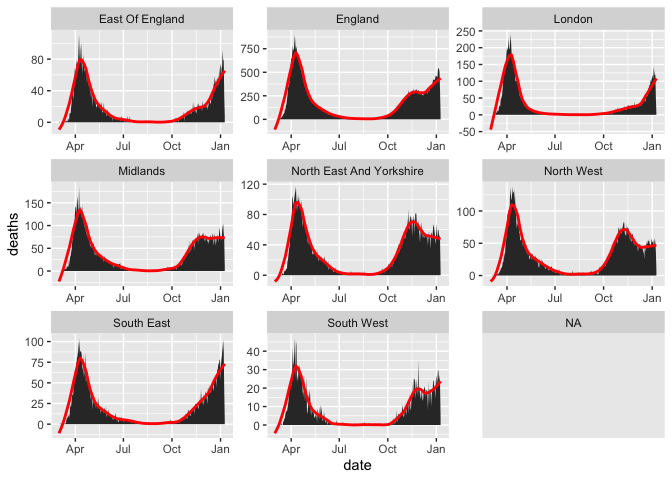
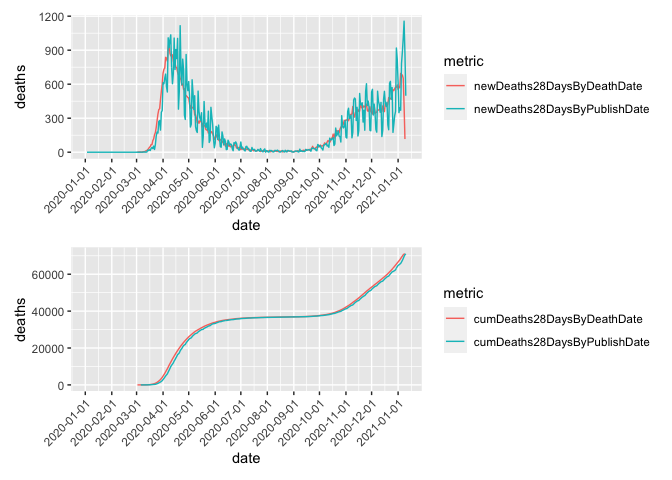

Understanding COVID deaths
================
Julian Flowers
10/01/2021

-   [How deaths are counted](#how-deaths-are-counted)
-   [Counting covid deaths](#counting-covid-deaths)
-   [Hospital deaths](#hospital-deaths)
-   [Reporting date vs death date](#reporting-date-vs-death-date)
-   [Excess deaths](#excess-deaths)
-   

## How deaths are counted

When someone dies:

-   The death is notified
-   The death is registered
-   A death certificate is issued. This is completed by the doctors who
    cared for the patient in their final illness
-   Doctors can enter up to 8 causes or contributory causes on the death
    certificate
-   Deaths are registered by the Office of National Statistics (ONS) who
    review the causes of death on the certificate and assign one to an
    underlying cause of death (UCOD). This is use to calculate death
    statistics by causes of death and uses an automated system
-   The fact of death is notified to the NHS Central Register (NHSCR)

<https://assets.publishing.service.gov.uk/government/uploads/system/uploads/attachment_data/file/916035/RA_Technical_Summary_-_PHE_Data_Series_COVID_19_Deaths_20200812.pdf>

> 4.5 Advantages of the PHE data series The PHE data series has the
> following advantages: • broad coverage by including deaths in anyone
> diagnosed with COVID-19, including those outside of hospital settings
> • timely reporting of deaths: there is on average 3 day time lag
> between the date of death and the date reported to PHE. Using multiple
> overlapping data sources, this delay is reduced by approximately 1-2
> days • optimises completeness of hospital reporting by combining
> information from multiple sources, making it less likely that deaths
> are missed • ensures England COVID-19 death reporting is consistent
> with how deaths are reported in the rest of the UK. 4.6 Limitations of
> the PHE data series The PHE data series does not include deaths in
> people where COVID-19 is suspected but not confirmed by testing
> (SARS-CoV-2 PCR either negative or not done). Furthermore, the PHE
> data series does not report cause of death, and as such represents
> deaths in people with COVID-19 and not necessarily caused by COVID-19.

## Counting covid deaths

[Blog]()

Many people want to know how many people die **of** COVID but there is
no simple way of counting how many deaths are attributable to
SARS-CoV-2. There are a number of approaches:

1.  Deaths in people who are COVID positive - how many people with COVID
    die? This is used for daily reporting of deaths.

    -   PHE calculate how many people die within 28 days of a COVID
        positive test on a daily basis
    -   They also calculate how many people die within 60 days of a
        positive test.
    -   This is criticised because it includes deaths from any cause,
        but 85% of all deaths within 28 days of a positive test have
        COVID recorded on the death certificate.

2.  Number of deaths with COVID on the death certificate \[\]

3.  Deaths in hospitalised patients who are COVID positive \[\]

4.  CQC notifications of deaths in care home residents \[\]

5.  Excess death reporting \[\]

## Hospital deaths

<!-- -->

## Reporting date vs death date

<!-- -->

## Excess deaths

## 

Between 20th March and 18th December there were 64490 more deaths in
England than would have been expected based on the previous 5 years
daily

<!-- -->

<!-- -->

<!-- -->

    ## # A tibble: 1 x 12
    ##   r.squared adj.r.squared sigma statistic  p.value    df logLik   AIC   BIC
    ##       <dbl>         <dbl> <dbl>     <dbl>    <dbl> <dbl>  <dbl> <dbl> <dbl>
    ## 1     0.963         0.958  434.      213. 4.41e-23     4  -282.  576.  586.
    ## # … with 3 more variables: deviance <dbl>, df.residual <int>, nobs <int>

    ##        1 
    ## 2062.927
